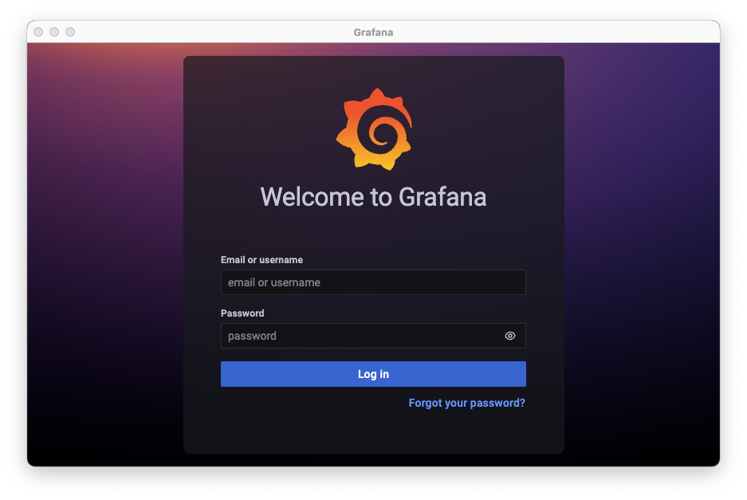
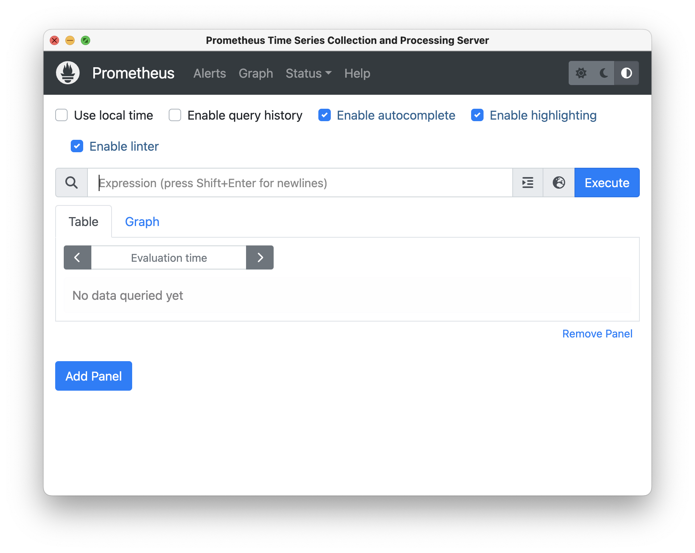

# Description
In this demo I'll show you how to create a Postgres cluster with CloudNativePG kubernetes operator. The features that I want to show you are:
- Kubernetes plugin install
- CloudNativePG operator install
- Postgres cluster install
- Insert data in the cluster
- Switchover (promote)
- Failover
- Backup
- Recovery
- Scale out/down
- Rolling updates (minor and major)
- Point In Time Recovery (PITR)
- Fencing
- Replication slots (for HA)
- Monitoring (Prometheus/Grafana)
- Operator upgrade
- PostgreSQL audit with PGAudit
- Last CloudNativePG tested version is 1.20.2

# Prerequisites
- K8s environment (K8s, k3d, kind)
- Docker
- Tested with K3d and kind. 
  - k3d is a lightweight wrapper to run k3s (Rancher Lab’s minimal Kubernetes distribution) in docker.
  - kind is a tool for running local Kubernetes clusters using Docker container “nodes”.
- jq (optional if you want to format JSON logs outputs)

# Demo
Execute commands in the correct order:
```
./01_install_plugin.sh
./02_install_operator.sh
./03_check_operator_installed.sh
./04_get_cluster_config_file.sh
./05_install_cluster.sh
```
Open a new session and execute:
```
./06_show_status.sh
```
Open another session and execute MinIO server (S3 Object Storage compatible):
Please, check the IP of your computer and replace in file cluster-example-upgrade.yaml.

- **URL:** http://127.0.0.1:9001
- **User:** admin
- **Password:** password
```
./start_minio_docker_server.sh
```
Go back to the previous session and execute:
```
./07_insert_data.sh
./08_promote.sh
./09_upgrade.sh
./10_backup_cluster.sh
./11_backup_describe.sh
./12_restore_cluster.sh
./13_failover.sh
./14_scale_out.sh
./15_scale_down.sh

# PITR
./16_pitr_insert_two_lines.sh
./17_pitr_backup.sh
./18_pitr_insert_new_line.sh
./19_pitr_restore_line_one.sh
```
# Major upgrade
Major upgrade feature has been introduced in 1.16 version.
In this demo I show you how to upgrade your cluster from PosgreSQL v13 to v14.
```
./20_create_cluster_v13.sh
./21_insert_data_cluster_v13.sh
./22_verify_data_inserted.sh
./23_upgrade_v13_to_v14.sh
./24_verify_data_migrated.sh
```
# Fencing and Hibernation
```
./30_fencing_on.sh
./31_fencing_off.sh
./32_hibernation_on.sh
./33_hibernation_off.sh
```
# Operator management
```
./40_operator_list_images.sh
./41_operator_upgrade.sh
```

To delete your cluster execute:
```
./delete_all_clusters.sh
```

If you want to delete and create your Kind and K3d clusters and pull the PostgreSQL images from Docker to Kind or/and K3d, execute this script:
```
# Warning: script adapted for K3d
./99_remove_cluster.sh
```
# Monitoring with Prometheus/Grafana
```
cd monitoring
./01_install_prometheus_repo.sh
./02_prometheus_operator.sh
./03_prometheus_rules.sh
./04_grafana_dashboard.sh
./05_port_forwarding_prometheus_grafana.sh

./99_remove_monitoring.sh
```

- To connect to Grafana dashboard: http://localhost:3000
  - **User:** admin
  - **Password:** prom-operator

- To connect to Prometheus dashboard: http://localhost:9090





# How to deploy and access the Kubernetes Dashboard
```
./dashboard_install.sh
```
# Uninstall Kubernetes Dashboard
```
./dashboard_uninstall.sh
```

# Useful commands
```
./get_ip.sh
```
